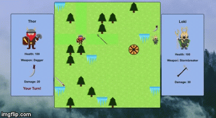

# Ragnarok Turn Based Game
##Turn based game for OpenClassrooms. The requirements were: 
- Each player attacks in turn
- The damage depends on the player's weapon
- The player can choose to attack or defend against the next shot
- If the player chooses to defend themselves, they sustain 50% less damage than normal
- As soon as the life points of a player (initially 100) falls to 0, they lose. A message appears and the game is over.

Made by [Cristobal Heiss](https://github.com/Ceheiss)

The game has two characters (Thor and Loki) and have to take turns to explore the map in order to find weapons before they fight. Besides weapons, a shield can be found that will upgrade the health of the player that finds it, also frostbites can be found in the map that will damage the player.

A little example of th game:

## Sample code
`
 // This functions generates que board calling on the diferent pieces
  function generateGame(){
  reset();
  // Anonymous functions so I can pass the parameters to the function without calling it
  generate(function(){
    placeElements("block");
  },12);
  generate(function(){
    placeElements("weapon-2");
  },1);
  generate(function(){
    placeElements("weapon-3");
  },1);
  generate(function(){
    placeElements("weapon-4");
  },1);
  generate(function(){
    placeElements("frostbite");
  },6);
  generate(function(){
    placeElements("shield");
  },1);
  generate(function(){
    placeElements("player-1");
  },1);
  generate(function(){
    placeElements("player-2");
  },1);
  movePlayer(player1);
  movePlayer(player2);
  pathHighlight();
  displayStats(player1);
  displayStats(player2);
  weaponDisplay(player1);
  weaponDisplay(player2);
  colorCheck(player1, "player1-health");
  colorCheck(player2, "player2-health");
  }
  `